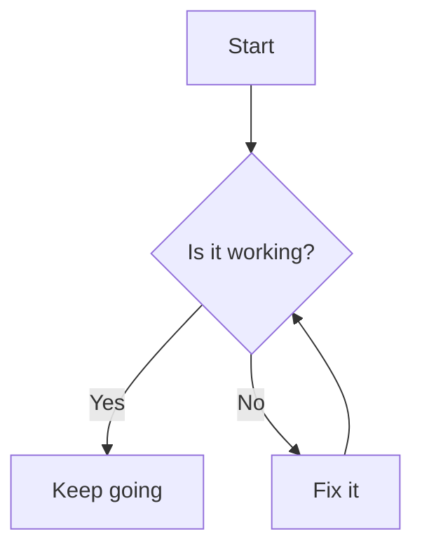
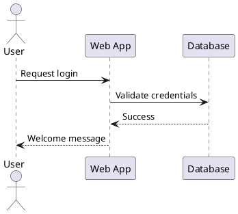

# New Sample Page Title

This new paragraph includes **bold**, _italic_, <u>underline</u>, and ~~strikethrough~~.

Here is a [link](https://example.com), an 😄, and a mention @Madushika Pramod

- Bullet list item 1
- Bullet list item 2

1. Ordered list item 1
2. Ordered list item 2

- [ ] Task list item

> **Decision:** Decision list item

this table doesn't work

| Header 1 | Header 2 |
| -------- | -------- |
| Cell 1   | Cell 2   |

```javascript
console.log('Hello, world!');
```

> **Info:** This is an info panel.

> This is a blockquote.

---


> **Warning:** This is a warning panel.

> **Error:** This is an error panel.

**Date:** 2025-06-15


# Diagram Examples

This document demonstrates how to embed both **Mermaid** and **PlantUML** diagrams in a Markdown file.

---

## Mermaid Flowchart



---

## PlantUML Sequence Diagram


